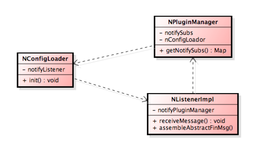

### bean初始化

源自一个应用启动时报的异常
```java
ERROR
  java.lang.NullPointerException: null
  at com.taobao.huijin.hjfinancegw.core.server.process.impl.NListenerImpl.assembleAbstractFinMsg(NListenerImpl.java:122) ~[hjfinancegw-core-1.0.0.37.jar:1.0.0.37]
```

查看最近一次发布分支
:

==**该行不大可能出现NPE，世界观颠覆了？？？**==

* 原因分析

经过调试代码，发现问题在应用启动阶段
NPluginManager.afterpropertiesSet() 循环获取所有bean的过程中
  -> applicationContext.getBean("beanName") 会获取"notifyListener"
  触发NListenerImpl初始化-> 注入nPluginManager属性，触发
  NPluginManager.afterpropertiesSet()
  -> NPluginManager.afterpropertiesSet()调用NConfigLoader.init()，该方法进行Notify监听注册，监听器就是nListenerImpl，
  而此时nListenerImpl的属性nPluginManager还是空，

  问题就出现在这，已经向notify订阅了，就会收到消息，而此时处理消息方法引用nPluginManager就会报错
  所以这是一个bean依赖关系导致初始化顺序错误的问题。

* 解决方案：

查看代码发现，
  NPluginManager.afterpropertiesSet()解析出notify的订阅topic，messageType
  然后调用了调用NConfigLoader.init()取进行notify订阅
  NConfigLoader.init()订阅消息又注册了nListenerImpl
  nListenerImpl又需要注入属性NPluginManager，导致依赖出现了环



解决的过程就是把环解开：
  1.NotifyPluginManager.afterpropertiesSet()解析出notify的订阅topic，messageType
  2.NotifyConfigLoader增加属性依赖NotifyPluginManager，主动调用NotifyPluginManager方法获取topic，messageType去订阅notify
  3.notifyListenerImpl 在xml的bean定义设置依赖depends-on：NotifyPluginManager 保证NotifyPluginManager先于notifyListenerImpl初始化

  调整后最终的依赖关系：


现在再看启动过程中订阅Notify时notifyListener的属性notifyPluginManager，已经被注入了，不会再出现为空的情况。


==**所以写代码不仅要保证bean被初始化，而且要保证被正确初始化，依赖关系、初始化时序很重要！**==

* 后续进一步优化

看代码中发现两个类都实现了InitializingBean接口，在afterpropertiesSet() 方法去遍历所有beanName，调用applicationContext.getBean("beanName")获取bean实例。 实际上一个应用可以只由一个类实现InitializingBean，在这个类注册多个pluginMageger，各自处理自己的实现。这样就一个应用就有一个循环获取所有bean，bean的初始化时序会更清晰：
:
