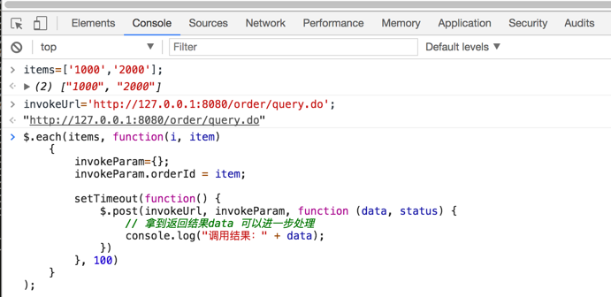
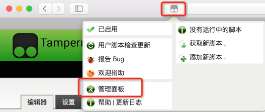
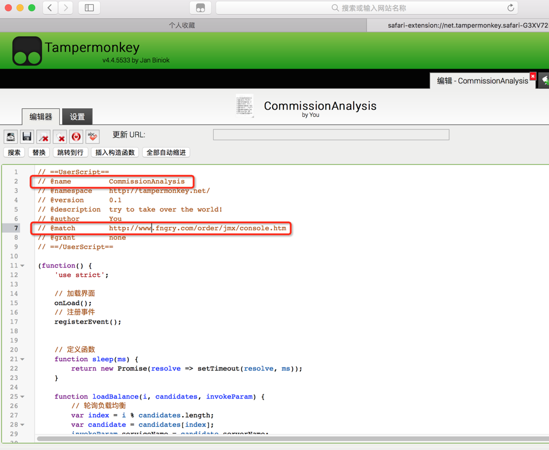

### Tampermonkey

* 界面提供了查询单据功能, 但只能单个查询, 对于批量查询怎么办?
* 在网站下打开控制台,可以访问该域名下所有http接口. 那么执行一段js循环调查询接口,然后汇总返回结果是可以实现的



```js
items=['1000','2000'];
invokeUrl='http://127.0.0.1:8080/order/query.do';

// 循环调用接口
$.each(items, function(i, item)
    {
        invokeParam={};
        invokeParam.orderId = item;

        setTimeout(function() {
            $.post(invokeUrl, invokeParam, function (data, status) {
                // 拿到返回结果data 可以像java一样处理对象
                console.log("调用结果：" + data);
            })
        }, 100)
    }
);
```

* 每次都要这么输入多段代码, 有没更省力的方法? 能不植入一段js代码到该网站下, 然后为所欲为?
* Tampermonkey 带来希望  
通过Tampermonkey植入, 在网站启动时自动加载用户自定义的js文件, 通过js脚本可以: 改变网页dom元素、注册自定义事件、循环调接口, 等等... 是不可以来抢票了？

* 使用方法  
安装插件后, 点插件图标进入版面管理:

从版面管理进入增加脚本:

编辑js脚本:  
    修改@name, 脚本名称  
    修改@match, 表示打开这个网址的时候加载自定义脚本  

